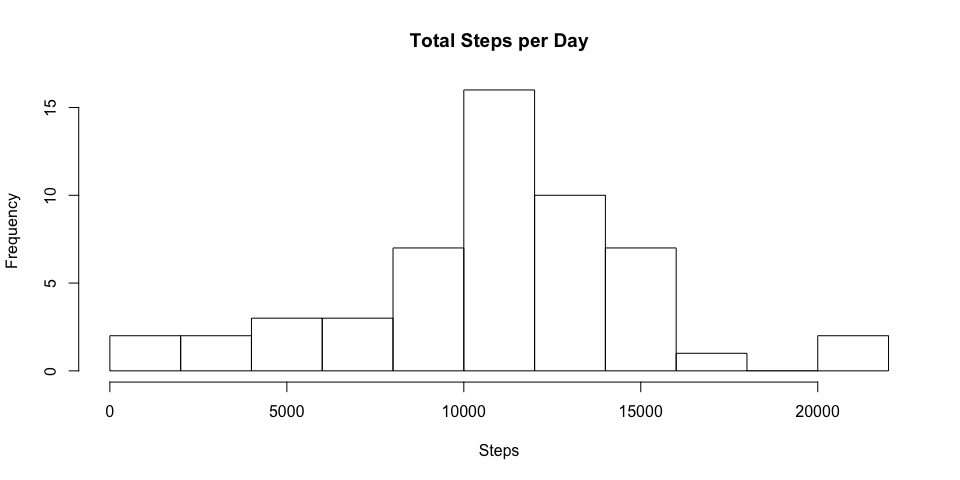
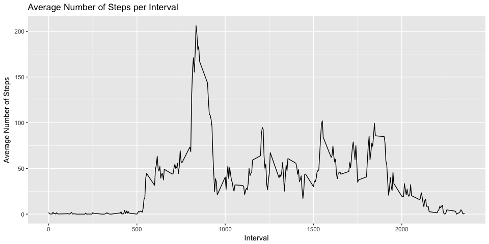
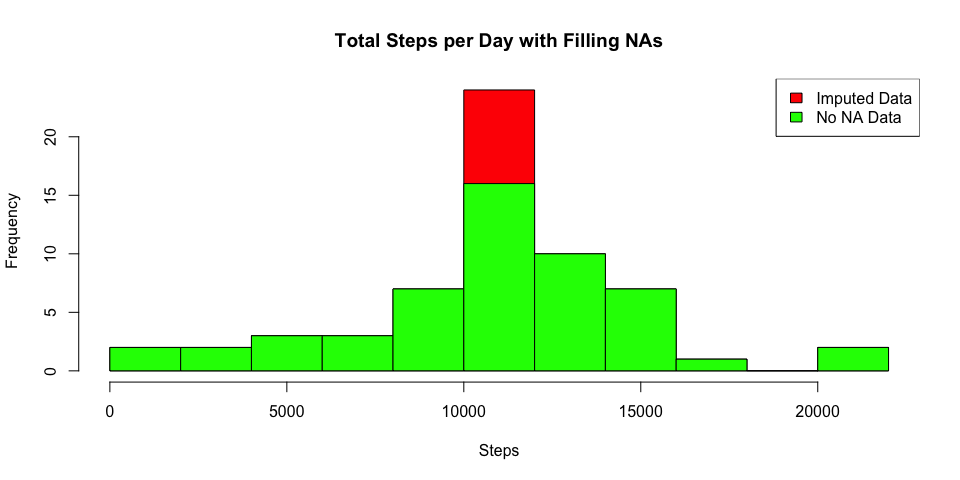
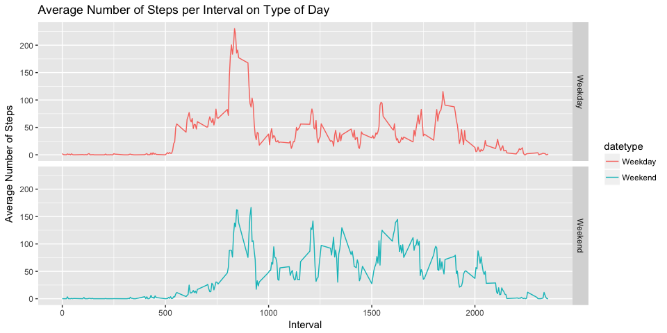

Introduction
------------

This assignment makes use of data from a personal activity monitoring
device. This device collects data at 5 minute intervals through out the
day. The data consists of two months of data from an anonymous
individual collected during the months of October and November, 2012 and
include the number of steps taken in 5 minute intervals each day.

The variables included in this dataset are:

-   **steps**: Number of steps taking in a 5-minute interval (missing
    values are coded as NA)
-   **date**: The date on which the measurement was taken in YYYY-MM-DD
    format
-   **interval**: Identifier for the 5-minute interval in which
    measurement was taken

The dataset is stored in a comma-separated-value (CSV) file and there
are a total of 17,568 observations in this dataset.

Loading and preprocessing the data
----------------------------------

Loading the data

    library(ggplot2)
    library(plyr)
    activity <- read.csv("~/course project/activity.csv")
    str(activity)

    ## 'data.frame':    17568 obs. of  3 variables:
    ##  $ steps   : int  NA NA NA NA NA NA NA NA NA NA ...
    ##  $ date    : Factor w/ 61 levels "2012-10-01","2012-10-02",..: 1 1 1 1 1 1 1 1 1 1 ...
    ##  $ interval: int  0 5 10 15 20 25 30 35 40 45 ...

    activity$date <- as.Date(activity$date) ## transfer factor to date

What is mean total number of steps taken per day?
-------------------------------------------------

Calsulate the total number of steps taken per day

    activityclean <- activity[!is.na(activity$steps),] ## remove NAs

    ## 1. Calculate the total number os steps tanken per day
    stepsumd <- aggregate(activityclean$steps ~ activityclean$date, FUN=sum)
    colnames(stepsumd)<- c("date", "steps")

    ## 2. Make a histogram of the total number of steps taken each day
    hist(stepsumd$steps, breaks=10, xlab="Steps", main = "Total Steps per Day")

    ## 3. Calculate and report the mean and median of the total number of steps taken per day
    MeanSteps <- mean(stepsumd$steps, na.rm = TRUE)
    MeanSteps

    ## [1] 10766.19

    MedianSteps <- median(stepsumd$steps, na.rm = TRUE)
    MedianSteps

    ## [1] 10765

What is the average daily activity pattern?
-------------------------------------------

1.  Make a time series plot (i.e. type = "l") of the 5-minute
    interval (x-axis) and the average number of steps taken, averaged
    across all days (y-axis).

<!-- -->

    ## 1. Calculating average steps
    averageSteps <- aggregate(x=list(avg_steps=activity$steps), by=list(interval=activity$interval), FUN=mean, na.rm=TRUE)

    ## 2. Plotting
    g <- ggplot(averageSteps, aes(x = interval, y = avg_steps))
    g + geom_line() + ggtitle("Average Number of Steps per Interval") + 
        xlab("Interval")+ylab("Average Number of Steps")

1.  Which 5-minute interval, on average across all the days in the
    dataset, contains the maximum number of steps?

<!-- -->

    ## Maximum steps 
    averageSteps[which.max(averageSteps$avg_steps),]

    ##     interval avg_steps
    ## 104      835  206.1698

Imputing missing values
-----------------------

1.  Calculate and report the total number of missing values in the
    dataset

<!-- -->

    sum(is.na(activity$steps))

    ## [1] 2304

1.  Devise a strategy for filling in all of the missing values in the
    dataset

We create a new data frame **activity2** that is equal to the original
dataset but with the missing data filled in through using mean for that
interval for imputation

1.  Create a new dataset that is equal to the original dataset but with
    the missing data filled in

<!-- -->

    activity2 <- activity
    na <- is.na(activity2$steps)
    avg_interval<- tapply(activity2$steps, activity2$interval, mean, na.rm=TRUE, simplify = TRUE)
    activity2$steps[na] <- avg_interval[as.character(activity2$interval[na])]
    head(activity2)

    ##       steps       date interval
    ## 1 1.7169811 2012-10-01        0
    ## 2 0.3396226 2012-10-01        5
    ## 3 0.1320755 2012-10-01       10
    ## 4 0.1509434 2012-10-01       15
    ## 5 0.0754717 2012-10-01       20
    ## 6 2.0943396 2012-10-01       25

    sum(is.na(activity2$steps))

    ## [1] 0

1.  Make a histogram of the total number of steps taken each day and
    Calculate and report the mean and median total number of steps taken
    per day

<!-- -->

    ## Calculate the total number os steps tanken per day
    stepsumd2 <- aggregate(activity2$steps ~ activity2$date, FUN=sum)
    colnames(stepsumd2)<- c("date", "steps")

    ## Make a histogram of the total number of steps taken each day
    hist(stepsumd2$steps, breaks=10, xlab="Steps", main = "Total Steps per Day with Filling NAs", col = "Red")
    hist(stepsumd$steps, breaks=10, xlab="Steps", main = "Total Steps per Day with Filling NAs", col = "Green", add = T)
    legend("topright", c("Imputed Data", "No NA Data"), fill = c("Red", "Green"))

    ## Calculate and report the mean and median of the total number of steps taken per day
    MeanSteps2 <- mean(stepsumd2$steps, na.rm = TRUE)
    MeanSteps2

    ## [1] 10766.19

    MedianSteps2 <- median(stepsumd2$steps, na.rm = TRUE)
    MedianSteps2

    ## [1] 10766.19

The new mean is 10766 and the new median is 10766 . Compare with the no
NAs data set (mean 10766 and median 10765) , the mean doesn't change,
and the median has a small change. It may because the filling strategy
we used (filling with means for intervals). From the histogram, we can
see now higher frequency counts in the histogram at the center region
(close to the mean).

Are there differences in activity patterns between weekdays and weekends?
-------------------------------------------------------------------------

    ## 1. Create a new factor variable in the dataset with two levels – “weekday” and “weekend”
    activity2$day <- weekdays(activity2$date)
    activity2$datetype <- ifelse(activity2$day %in% c("Saturday", "Sunday"), "Weekend", "Weekday")
    head(activity2)

    ##       steps       date interval    day datetype
    ## 1 1.7169811 2012-10-01        0 Monday  Weekday
    ## 2 0.3396226 2012-10-01        5 Monday  Weekday
    ## 3 0.1320755 2012-10-01       10 Monday  Weekday
    ## 4 0.1509434 2012-10-01       15 Monday  Weekday
    ## 5 0.0754717 2012-10-01       20 Monday  Weekday
    ## 6 2.0943396 2012-10-01       25 Monday  Weekday

    ## 1. Create a new factor variable in the dataset with two levels – “weekday” and “weekend”
    activity2$day <- weekdays(activity2$date)
    activity2$datetype <- ifelse(activity2$day %in% c("Saturday", "Sunday"), "Weekend", "Weekday")
    head(activity2)

    ##       steps       date interval    day datetype
    ## 1 1.7169811 2012-10-01        0 Monday  Weekday
    ## 2 0.3396226 2012-10-01        5 Monday  Weekday
    ## 3 0.1320755 2012-10-01       10 Monday  Weekday
    ## 4 0.1509434 2012-10-01       15 Monday  Weekday
    ## 5 0.0754717 2012-10-01       20 Monday  Weekday
    ## 6 2.0943396 2012-10-01       25 Monday  Weekday

    ## 2. Calculating average steps
    averageSteps2 <- aggregate(steps ~ interval + datetype, data = activity2, mean)

    ## 3. Plotting
    t <- ggplot(averageSteps2, aes(x = interval, y = steps, color = datetype))
    t + geom_line() + facet_grid(datetype ~ .) +
        ggtitle("Average Number of Steps per Interval on Type of Day") + 
        xlab("Interval")+ylab("Average Number of Steps")

From the panel plot we can see the weekday activities start earlier than
the weekends. But the weekends have higher activity levels than the
weekdays. It may because people have more flexible time during weekend
to do activities.
